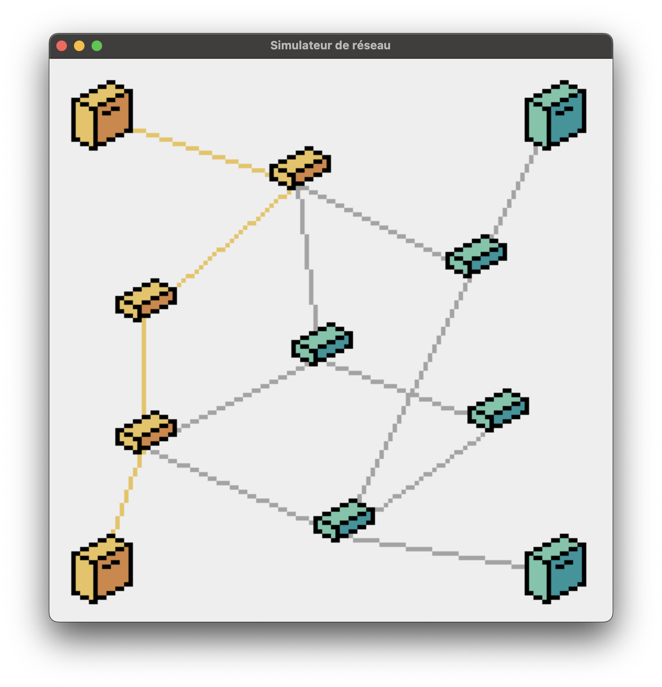
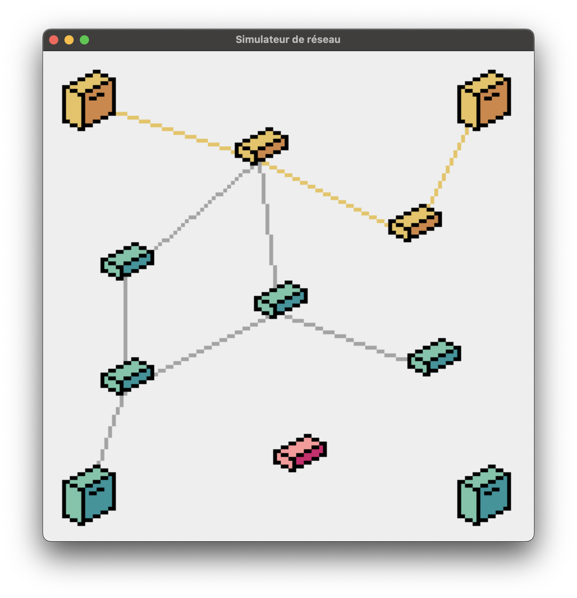

# Simulateur de réseau informatique
NetworkSimulator est un simulateur de réseau informatique graphique développé en Python avec la librairie [Pyxel](https://github.com/kitao/pyxel).

## Présentation

Le réseau informatique comporte 4 ordinateurs (dans les 4 angles) et 7 routeurs (au centre de l'image). Il reprend le fonctionnement d'un réseau classique et fonctionne de manière autonome. Le programme choisi aléatoirement 2 ordinateurs et cherche de trajet le plus efficace suivant le protocole OSPF implémenté en Python.

Des routeurs peuvent également tomber en panne aléatoirement et se déconnectent donc du réseau et se mettant en rouge.

Les éléments en vert sont opérationnels, les éléments en orange représentent le chemin calculé par l'algorithme OSPF et les éléments en rouge représentent un routeur en panne ou les ordinateurs ne pouvant pas être relié.

Il est également possible de mettre en pause le jeu en cliquant sur la barre espace.

## Développement

Le projet est développé en Python 3.10 avec la librairie [Pyxel](https://github.com/kitao/pyxel) pour la gestion graphique et la librairie [heapq](https://docs.python.org/fr/3/library/heapq.html) pour l'implémentation de l'algorithme OSPF.

## Tester le simulateur

Il est possible de tester le simulateur compilé en HTML avec Pyxel en cliquant [ici](https://johanldx.github.io/NetworkSimulator/) ou en ouvrant le lien disponible dans la partie *About* de cette page.

## Capture d'écran

*Chemin calculé entre l'ordinateur C1 et l'ordinateur C3.*

*Chemin calculé entre l'ordinateur C1 et l'ordinateur C2 avec un routeur en panne.*

